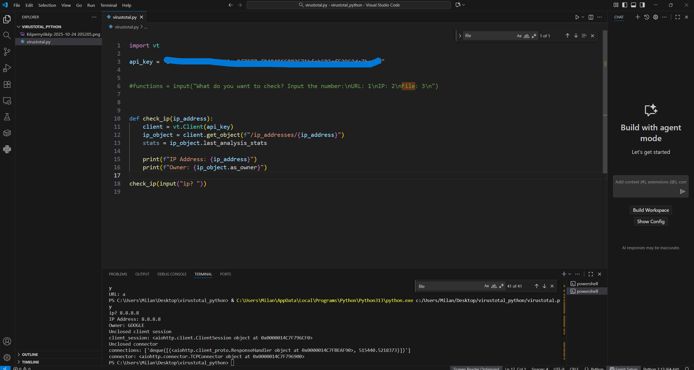

# Virustotal In Python

I created a small python program using Virustotal API to search 
for  malicious URLs and IPs.

The goal was to write a cybersecurity related automation.

---
### 1. Install

- Installed API using pip install vt-py

---

### 2. Testing the IP check function

---

### 3. Developing URL scanner

---

### 4. Testing the program

---

### 5. Done!

---

## Usage ##
- The program first asks the user: What do you want to check?
- The user can select these:
1. IP
2. URL

- After pasting the input the program runs and prints the result.